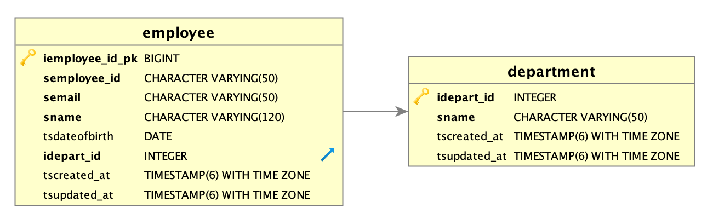

## Employee Service API

 - The employee service is responsible for managing the department and employee of the company.
 - This service provides REST endpoints for the below operations,
    - Create a Department
    - Create an Employee
    - Update details for the specific Employee
    - Delete Employee record
    - Fetch details for the specific Employee
 - This service produces event in Kafka topic whenever an employee is created, updated or deleted.
    - The messages will be in AVRO format with key as "employeeId", and the messages with the same key always go to the same partition in a topic which guaranties that the consumer consumes the employee events in sequential order.

### Data Model



- **Description**
    - *Department*
        - `idepart_id` - The identifier of the department and it is auto generated value.
        - `sname` - Name of the department.
        - `tscreated_at` - The timestamp when the department created.
        - `tsupdated_at` - The timestamp when the department last updated.
    - *Employee*
        - `iemployee_id_pk` - This the primary key of the table and holds the auto generated value.
        - `semployee_id` - The identifier of the employee in UUID format.
        - `semail` - This fields stores the employee email.
        - `sname` - This fields stores the name of the employee.
        - `tsdateofbirth` - This fields stores the date of birth of the employee.
        - `idepart_id` - This fields stores the department id which the employee belongs and this has foreign key relation with department entity.
        - `tscreated_at` - The timestamp when the employee created.
        - `tsupdated_at` - The timestamp when the employee last updated.     

### Setup Local Environment

- *Ensure that below listed directories are empty,*
    - `local/db/data` - The data directory for postgres database.
    - `local/pgadmin-data` - The data directory for PgAdmin (UI for managing postgres database)
- *Go the "local" folder and execute `docker-compose up -d` and this will create the below containers,*

```
PORTS                                        NAMES
443/tcp, 0.0.0.0:8050->80/tcp                pgadmin-web
0.0.0.0:5432->5432/tcp                       postgres-db
0.0.0.0:8060->8000/tcp                       cp-schema-registry-ui
0.0.0.0:9100->9000/tcp                       kafdrop-ui
0.0.0.0:8081->8081/tcp                       cp-schema-registry
0.0.0.0:9092->9092/tcp                       cp-kafka-1
2888/tcp, 0.0.0.0:2181->2181/tcp, 3888/tcp   cp-zookeeper
```
- *Verify the whether the `empdb` database created in postgres by login to [PgAmin](http://localhost:8050/)*
    - Login using email: `postgrestest@gmail.com` and password: `postgres`
    - Create Server: 
        - Right click on "Servers" 
        - Create -> Server -> Enter Name (General Tab) and enter connection details (Connection Tab) -> Save
        - Connection Host: `postgres-db`, Port: `5432`, Maintenance database: `postgres`, Username: `postgres01`, Password: `password123`
    - Connnect to Server then verify the `empdb` under "Databases"
- *Create Kafka Topic through [Kafdrop-UI](http://localhost:9100/)*
    - Click "New" under "Topics" section
        - Name should be `takeway_employee_updates`
        - Partition: 2 and Replication Factor: 1
- *Register AVRO Schema through [Schema Registry UI](http://localhost:8060/)*
    - Register Key Schema
        - Click on "New" and enter name: `takeway_employee_updates-com.takeaway.challenge.EmployeeEventKey`
        - Copy and paste the content from file `src/main/avro/EmployeeEventKey.avsc`
        - Click on "Validate" and then "Create New Schema"
    - Register Value Schema
        - Click on "New" and enter name: `takeway_employee_updates-com.takeaway.challenge.EmployeeEventValue`
        - Copy and paste the content from file `src/main/avro/EmployeeEventValue.avsc`
        - Click on "Validate" and then "Create New Schema"
    
## Build

- You can build the project below command,

```bash
mvn clean install

# In case, you want to skip executing the tests,

mvn clean install -DskipTests
```

**Note:** You will see compilation errors when you open the projects for the very first time, that is because of `Auto generated` classes and the errors will disappear after building the project.  

## Run as Docker Container

- Build the docker image in local by executing the below command from project folder,

```bash
docker build . --tag=sankarmanthiram/bob-challenge-employee-service:1.0.0

# Please below command when you want to push the image to docker registry

docker push sankarmanthiram/bob-challenge-employee-service:1.0.0
```

- Verify the docker image by executing `docker image ls`
- Execute command: `docker-compose up -d` which will create docker container with name: `employee-service`
- Please visit [Swagger-UI](http://localhost:8070/takeaway/swagger-ui/index.html) for knowing more about Employee Service APIs. 

## Run in Local (In command line)

- Execute the below command after building the project successfully

```bash
java -jar -Dlogging.config=classpath:logback-local.xml -Dspring.profiles.active=local bob-challenge-employee-service-1.0.0.jar
```
- Please visit [Swagger-UI](http://localhost:8070/takeaway/swagger-ui/index.html) for knowing more about Employee Service APIs. 

## Database Migration

- The database migration is a automatic process which happens during the application start up. It will create all necessary objects required by the application.
- The migration is done by `Flyway Tool` which is a open source database-migration tool.
- The database migration scripts are maintained in folder: `src/main/resources/db/migration`.
- Flyway creates table `flyway_schema_history` in "public" schema for versioning and storing the history of execution.

## Other Information

- In case you want to **recreate the database**, then simply delete all data from folders: `local/db/data` & `local/pgadmin-data` and execute `docker-compose up -d`
- In case you want to **view Kafka Messages**, then please visit to [Kafdrop-UI](http://localhost:9100)
    - Click on topic name: `takeway_employee_updates` under "Topics" section
    - Click on "View Messages" -> Select key format as "AVRO" and value format as "AVRO" then submit "View Messages"
    - Please change the "Partition" number if in case you want to see particular partition messages.